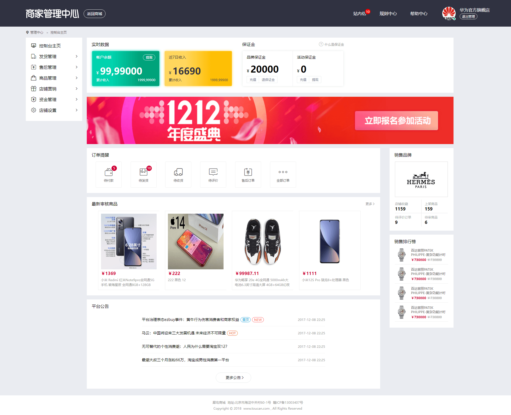
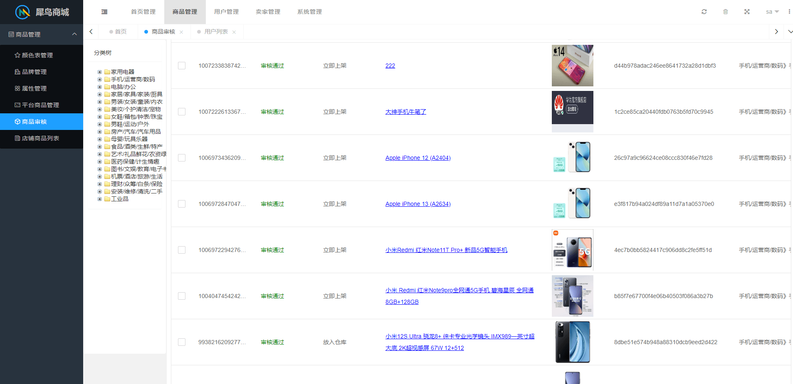
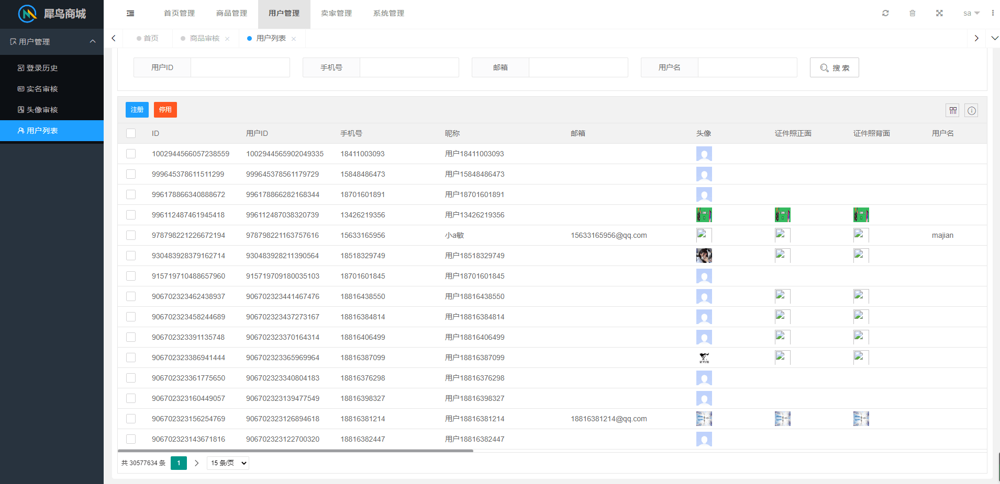
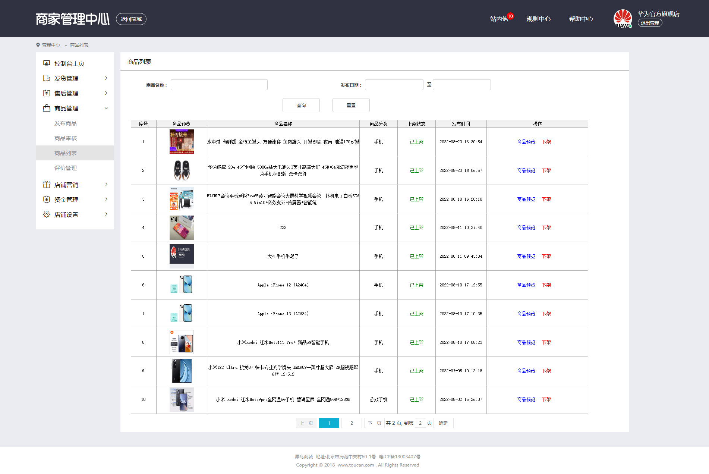
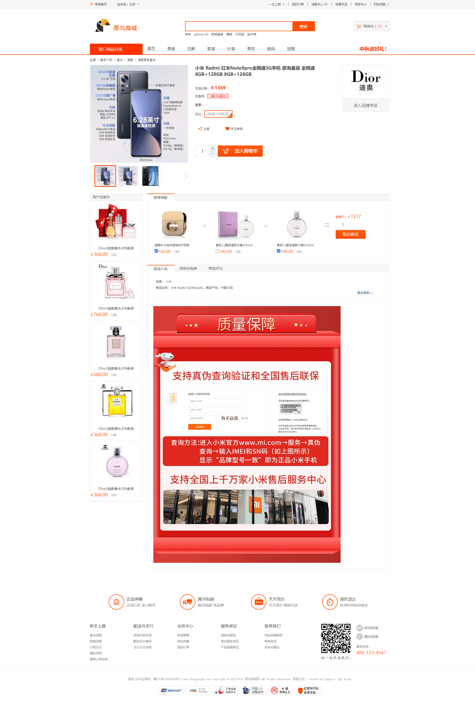
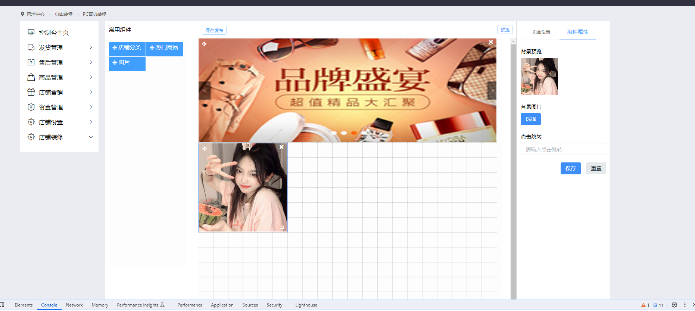
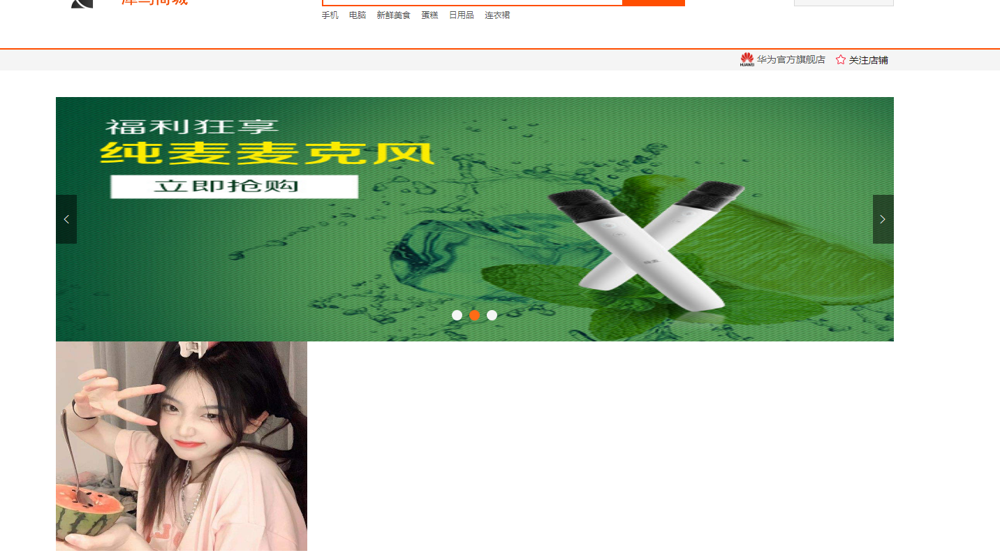

# 犀鸟电商平台

    犀鸟电商平台致力于快速搭建属于自己的电商网站
    开源协议采用MIT协议,任何人都可以用这个项目进行商用以及二次开发

#### 标准版
    采用技术spring boot、spring config、mybatis、lombok、elasticsearch、kafka、shardingsphere、redis、mysql

#### 微服务版
    采用技术spring cloud、spring config、lombok、mybatis、nacos、canal、hystrix、elasticsearch、kafka、shardingsphere、redis、mysql

   
### 访问

    商城端
    http://8.140.187.184:8083/ 
    账号:18701601893
    密码:123456
    
    卖家管理后台
    http://8.140.187.184:8101/ 
    账号:18701601893
    密码:123456
    

    权限管理中心 
    http://8.140.187.184:8098/
    账号(只读):testuser001
    密码(只读):test123

    商城管理后台
    http://8.140.187.184:8088/
    账号(只读):testuser001
    密码(只读):test123
    账号(可增删改):testuser002
    密码(可增删改):test123
    账号(可增删改):testuser003
    密码(可增删改):test123
    
    注:可以私信我要最高管理员权限

### 数据库
    表结构存放在resources/数据库备份目录下
    注意:由于开发中会修改表字段,该备份不会实时更新,可以私信找我要最新表结构
    邮箱:mmdrss@163.com
    QQ:695391446

### 产品预览图
   
   * C端首页
   

   * 卖家中心首页
   

   * 后台管理-商品审核
   
   
   * 后台管理-用户列表
   
   
   * 商品审核列表
   
   
   * 商品详情
   
   
   * 商品详情
   
   
   * 商品详情
   

### 参与贡献
    
    1.majian
    2.niuyuxiao
    3.fenghuimin
    4.M_Y